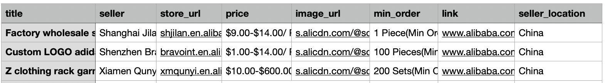

# Alibaba parser using scrapingant.com
This project shows how to use <a href="https://scrapingant.com">ScrapingAnt</a> scraping service to load public data from alibaba.

ScrapingAnt takes away all the messy work necessary to set up a browser and proxies for crawling. So you can just focus on your data.
## Usage
To run this code you need RapidApi key. Just go to <a href="https://rapidapi.com/okami4kak/api/scrapingant">ScrapingAnt page on Rapidapi</a>, and click "Subscribe to Test" button. After that you have to select plan(there is a free one including 100 requests). After that you can find you api key in "X-RapidAPI-Key" field on <a href="https://rapidapi.com/okami4kak/api/scrapingant/endpoints">endpoints</a> page.
#### With Docker
```shell script
docker build -t alibaba_scraper . && docker run -it -v ${PWD}/data:/app/data alibaba_scraper adidas --rapidapi_key <RAPID_API_KEY>
```

#### Without Docker
This code was written for python 3.7+
```shell script
git clone https://github.com/ScrapingAnt/alibaba_scraper.git
cd alibaba_scraper
python3 -m venv .env
.env/bin/pip install -r requirements.txt
.env/bin/python main.py --help
.env/bin/python main.py adidas --rapidapi_key <RAPID_API_KEY>
```
#### Available params
```
.env/bin/python python main.py --help

Usage: main.py [OPTIONS] SEARCH_STRING

Options:
  --rapidapi_key TEXT             Api key from https://rapidapi.com/okami4kak/api/scrapingant  [required]
  --pages INTEGER                 Number of search pages to parse
  --country [ae|br|cn|de|es|fr|gb|hk|in|it|il|jp|nl|ru|sa|us]
                                  Country of proxies location
  --help                          Show this message and exit.
```
#### Sample output:
Output is saved to data/ directory in csv format.

